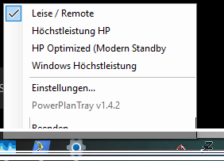

# PowerPlanTray

Minimalistisches Windows-Tray-Tool zum schnellen Umschalten zwischen vorhandenen Energieplänen unter Windows 11.

Aktuelle Version: **1.5.0**

## Funktionen

- Liest vorhandene Energiepläne dynamisch über `powercfg /list` ein
- Zeigt den aktuell aktiven Energieplan im Tray an
- Rechtsklick auf das Tray-Symbol: Energieplan direkt auswählen
- Linksklick auf das Tray-Symbol: zwischen zwei frei wählbaren Energieplänen umschalten
- Einstellungen werden unter `%APPDATA%\PowerPlanTray\settings.json` gespeichert
- Optionaler Autostart über **Mit Windows starten**
- Optionaler fester Energieplan beim Windows-Start
- Alternativ kann der zuletzt aktive Energieplan weiterverwendet werden
- Statusaktualisierung alle 5 Sekunden
- Portable, selbstständige Single-EXE für Windows x64

## Energiepläne

PowerPlanTray übernimmt die auf dem jeweiligen Windows-System vorhandenen Energiepläne automatisch.

Zusätzlich wird **Windows Höchstleistung** immer als auswählbarer Eintrag angeboten. Dieser Eintrag verwendet intern den Windows-Alias:

`SCHEME_MIN`

Die bekannte Windows-GUID lautet:

`8c5e7fda-e8bf-4a96-9a85-a6e23a8c635c`

Dadurch kann der Windows-Höchstleistungsplan auch dann aktiviert werden, wenn er vorher nicht in `powercfg /list` angezeigt wird.

## Bedienung

### Linksklick

In den Einstellungen können zwei Energiepläne als **Plan A** und **Plan B** festgelegt werden. Ein Linksklick auf das Tray-Symbol wechselt direkt zwischen diesen beiden Plänen.

### Rechtsklick

Das Kontextmenü zeigt alle erkannten Energiepläne sowie **Windows Höchstleistung**. Der aktive Plan wird mit einem Haken markiert.



Zusätzlich stehen dort zur Verfügung:

- Einstellungen
- aktuelle Programmversion
- Beenden

## Einstellungen

Über **Einstellungen...** können folgende Optionen geändert werden:

- **Linksklick Plan A**
- **Linksklick Plan B**
- **Mit Windows starten**
- **Energiesparplan beim Windows-Start** – legt einen festen Energieplan fest, der beim Windows-Autostart aktiviert wird
- **Letzten Energiesparplan verwenden** – lässt den zuletzt aktiven Windows-Energieplan unverändert; die feste Startplan-Auswahl ist dann deaktiviert


Der Autostart wird benutzerspezifisch unter folgendem Registry-Pfad verwaltet:

`HKCU\Software\Microsoft\Windows\CurrentVersion\Run`

Die Startplan-Logik wird nur beim Windows-Autostart von PowerPlanTray ausgeführt. Wird PowerPlanTray später manuell gestartet, wird der aktuellen Energieplan dadurch nicht verändert.

PowerPlanTray benötigt dafür keine Änderung an systemweiten Autostart-Einstellungen.

## Tray-Symbole

Die Energiepläne werden durch kompakte Tray-Symbole unterschieden:

- **Höchstleistung HP** – weißer Blitz im Kreis
- **Windows Höchstleistung** – derselbe Blitz in Rot
- **HP Optimized (Modern Standby)** – weißes Symbol mit durchgestrichenem Blitz
- **Leise / Remote** – weißes ZZZ-Symbol
- andere Energiepläne – neutrales Symbol

Das Anwendungs- und Einstellungsfenster verwendet weiterhin das normale PowerPlanTray-Blitzsymbol.

## Verhalten von PowerPlanTray

PowerPlanTray verändert beim normalen Umschalten **keine einzelnen Energieplaneinstellungen**. Ein ausgewählter Plan wird ausschließlich über

```text
powercfg /setactive <GUID oder Alias>
```

aktiviert.

Beim Windows-Autostart kann PowerPlanTray abhängig von der gewählten Einstellung entweder einen festgelegten Energieplan aktivieren oder den zuletzt aktiven Energieplan unverändert lassen.

Modern Standby und vorhandene Energieplanparameter werden vom Tool nicht verändert.

## Build

Voraussetzung für einen lokalen Build ist das .NET 8 SDK.

```powershell
dotnet publish -c Release -r win-x64 --self-contained true /p:PublishSingleFile=true /p:EnableCompressionInSingleFile=true
```

Die EXE liegt anschließend unter:

`bin/Release/net8.0-windows/win-x64/publish/PowerPlanTray.exe`

## GitHub Actions

Bei Änderungen auf dem Hauptbranch erstellt GitHub Actions automatisch eine portable Windows-x64-Version. Nach erfolgreichem Lauf steht sie im jeweiligen Workflow unter **Artifacts** als `PowerPlanTray-win-x64` bereit.

## Änderungen in 1.5.0

- neuer auswählbarer **Energiesparplan beim Windows-Start**
- neue Option **Letzten Energiesparplan verwenden**
- feste Startplan-Auswahl wird deaktiviert, wenn der letzte Energieplan verwendet werden soll
- Startplan wird ausschließlich beim Windows-Autostart angewendet

## Änderungen in 1.4.2

- **Windows Höchstleistung** erhält zur eindeutigen Unterscheidung den vorhandenen Blitz in Rot
- **Höchstleistung HP** behält unverändert den weißen Blitz
- übrige Tray-Symbole bleiben unverändert

## Änderungen in 1.4.1

- eigenes PowerPlanTray-Anwendungssymbol für EXE und Einstellungsfenster
- korrekte Verarbeitung deutscher Energieplannamen und Umlaute aus `powercfg`

## Änderungen in 1.4.0

- dynamische Erkennung vorhandener Energiepläne
- frei wählbare Pläne für den Linksklick-Wechsel
- Einstellungsdialog
- Autostart-Option
- Versionsanzeige
- zusätzlicher Eintrag **Windows Höchstleistung** über `SCHEME_MIN`
